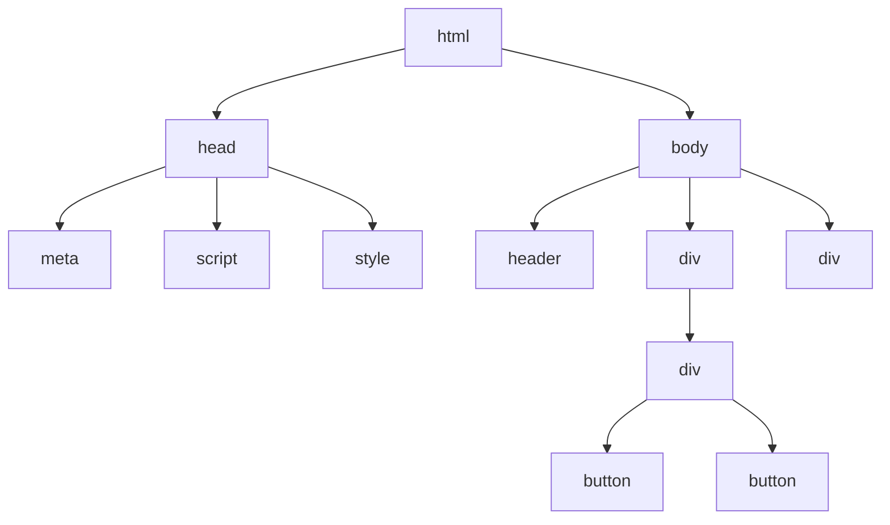

#html 

超文本标记语言

# 文件结构

web开发通常的文件结构
index.html
images folder
styles folder
scripts folder

分别代表HTML，CSS，JavaScripts


# HTML语言的大致结构

称之为DOM树



[[HTML skeleton]]
# 元素构成

元素与标签

```html
<p>这是一个段落</p>
```

- `<p>` 是标签。
- `<p>这是一个段落</p>` 是元素。


元素详解

1. **开始标签**（Opening tag）：包含元素的名称（本例为 p），及一对包围名称的**尖括号**。这表示元素从这里开始或者开始起作用——在本例中即段落由此开始。
2. **结束标签**（Closing tag）：与开始标签相似，只是其在元素名之前包含了一个*正斜杠*。这表示元素到这里结束——在本例中即段落在此结束。初学者常常会犯忘记添加结束标签的错误，这可能会产生一些奇怪的结果。
3. **内容**（Content）：元素的内容，本例中就是所输入的文本本身。
4. **元素**（Element）：开始标签、结束标签与内容相结合，便是一个完整的元素。

元素也可以有下图中那样的属性（Attribute）：


属性包含的是不想在真正的内容中出现的和元素有关的额外信息。本例中，`class` 是属性_名_，`editor-note` 是属性_值_。`class` 属性是可以用于定位元素（以及任何其他有相同 `class` 值的元素）的标识名称，以便进一步为元素指定样式或进行其他操作时使用。一些属性没有值，如 [`required`](https://developer.mozilla.org/zh-CN/docs/Web/HTML/Attributes/required)。

有值的属性应该包含：

1. 属性与元素名称（或上一个属性，如果元素有超过一个属性的话）之间的一个空格。
2. 属性名，后接一个等号。
3. 一对引号包围的属性值。

**备注：**不包含 [ASCII](https://developer.mozilla.org/zh-CN/docs/Glossary/ASCII) 空格（以及 `"` `'` `` ` `` `=` `<` `>`）的简单属性值可以不使用引号，但是建议将所有属性值用引号括起来，这样的代码一致性更佳，更易于阅读。

## 嵌套元素

也可以将一个元素置于其他元素之中——称作**嵌套**。要表明猫咪**非常**暴躁，可以将“very”用 [`<strong>`](https://developer.mozilla.org/zh-CN/docs/Web/HTML/Element/strong) 元素包围，“very”将突出显示：

```
<p>My cat is <strong>very</strong> grumpy.</p>
```

必须保证元素的嵌套次序正确：在上面的例子中，首先使用 [`<p>`](https://developer.mozilla.org/zh-CN/docs/Web/HTML/Element/p) 标签，然后是 [`<strong>`](https://developer.mozilla.org/zh-CN/docs/Web/HTML/Element/strong) 标签，因此要先结束 [`<strong>`](https://developer.mozilla.org/zh-CN/docs/Web/HTML/Element/strong) 标签，最后再结束 [`<p>`](https://developer.mozilla.org/zh-CN/docs/Web/HTML/Element/p) 标签。这样是不对的：

```
<p>My cat is <strong>very grumpy.</p></strong>
```

元素必须正确地开始和结束，才能清楚地显示出正确的嵌套层次。要是像上面那样交叠使用，浏览器就得自己猜测，虽然它会竭尽全力，但很大程度不会给你期望的结果。所以一定要避免！

## 空元素

不包含任何内容的元素称为[**空元素**](https://developer.mozilla.org/zh-CN/docs/Glossary/Void_element)。我们以 HTML 页面中已有的 [``](https://developer.mozilla.org/zh-CN/docs/Web/HTML/Element/img) 元素为例：

```

```

本元素包含两个属性，但是并没有 `</img>` 结束标签，元素里也没有内容。这是因为图像元素不需要通过内容来产生效果，它的作用是向其所在的位置嵌入一张图片。


# 常用标签

Quick look at HTML
- Syntax: `<div id="xx" class="yy" style="zz">hello world</div>`
- Let's take a look the most commonly used elements. The first few elements are quite familiar: `<html>`, `<head>`, `<meta>`, `<title>`, `<body>`, `<header>`, `<footer>`, `<article>`, `<section>`, `<p>`, `<div>`, `<span>`, `<button>`, `<input>`, ``, `<audio>`, `<video>`, `<canvas>`, `<ul>`, `<ol>`, `<li>`
- Do not know: `<aside>`, `<datalist>`, `<details>`, `<embed>`, `<nav>`, `<output>`, `<progress>`
  - And I forget the difference between `<canvas>` and ``. Precisely, what does `<canvas>` for?
    - Well, `<canvas>` can deal with something named canvas scripting API or WebGL to draw graphics and animations. sounds like it's for web game development. cool!
  - `<aside>`: looks like a quote but semantically like a comment.
  - `<datalist>`: ok, datalist consists of `<option>s`, simple.
  - `<details>`: when you click a `<summary>`, it will display its `<details>`. useful.
  - `<embed>`: the example for this element is a video embed in the page. fuck...I think it's a general purpose element for multi-media.
  - `<nav>`: semantically, it's a navigation. but it is just a list indeed. Maybe it has some special uses.
  - `<output>`: nothing special, just somewhere to show output.
  - `<progress>`: well, just a progress bar.
- `<table>`: not sure if it is out of date. just leave it.
- Ok, let's finish HTML part for day1.


# 元素组织结构

